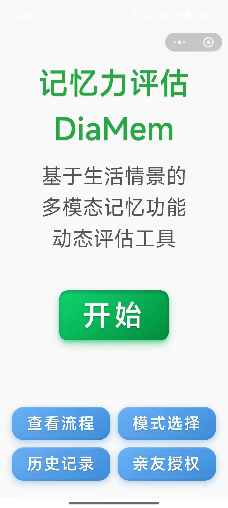
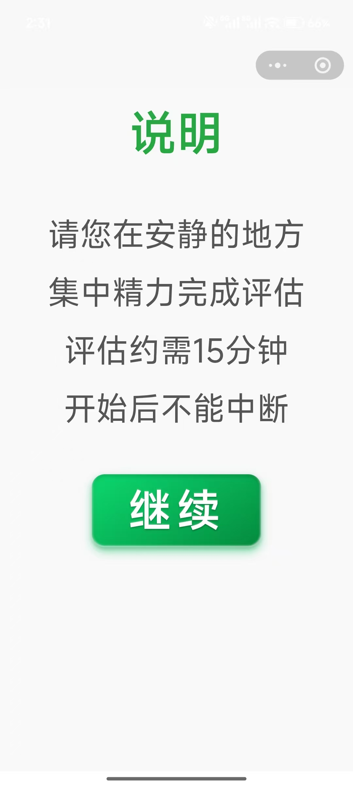

# 🧠 DiaMem — 基于随机刺激替换的移动记忆监测工具

> 一款专为老年人设计的微信小程序，用于**高频次、无学习效应的记忆自评**，适用于认知训练效果追踪、社区筛查和临床研究。

---

## 📌 项目背景

认知障碍疾病已成为我国的重要公共卫生问题。2023年我国阿尔茨海默病及相关痴呆患病人数已达2029.9万[1]，60岁及以上人群轻度认知障碍患病率达15.5%[2]。认知训练等干预措施已被证明可以延缓认知功能下降[3]，但实践中面临一个关键问题：如何判断干预是否有效？目前常用的认知评估工具（如MoCA）存在明显的学习效应，不适合短期内重复测量[7]，且其最小可检测变化为4分[7]，难以捕捉细微的认知变化。与此同时，认知障碍疾病的临床研究也因缺乏适合重复施测的动态评定工具而更为耗时费力——AD药物III期试验往往需要长达18个月、超过1700例样本[8, 9]，而糖尿病或高血压试验仅需3-6个月、样本量也更小[10, 11]。重复测量取均值是降低偶然误差、缩减样本量的常用策略[11]，但现有认知评估工具的设计初衷是诊断/筛查而非动态评定，无法满足这一需求。**DiaMem** 应运而生，旨在填补“可重复、生态效度高、易用”的记忆监测工具空白。

**参考文献**
[1] Institute for Health Metrics and Evaluation (IHME). Global Burden of Disease Study 2023 (GBD 2023) Results. Seattle, WA: IHME; 2025.
[2] 中华医学会神经病学分会痴呆与认知障碍学组. 阿尔茨海默病源性轻度认知障碍诊疗中国专家共识2024. 中华神经科杂志, 2024, 57(7): 715-737.
[3] Livingston G, Huntley J, Liu KY, et al. Dementia prevention, intervention, and care: 2024 report of the Lancet standing Commission. Lancet, 2024, 404(10452): 572-628.
[7] Feeney J, Savva GM, O'Regan C, et al. Measurement Error, Reliability, and Minimum Detectable Change in the Mini-Mental State Examination, Montreal Cognitive Assessment, and Color Trails Test among Community Living Middle-Aged and Older Adults. J Alzheimers Dis, 2016, 53(3): 1107-1114.
[8] van Dyck CH, Swanson CJ, Aisen P, et al. Lecanemab in Early Alzheimer's Disease. N Engl J Med, 2023, 388(1): 9-21.
[9] Sims JR, Zimmer JA, Evans CD, et al. Donanemab in Early Symptomatic Alzheimer Disease: The TRAILBLAZER-ALZ 2 Randomized Clinical Trial. JAMA, 2023, 330(6): 512-527.
[10] Xu M, Sun K, Xu W, et al. Fotagliptin monotherapy with alogliptin as an active comparator in patients with uncontrolled type 2 diabetes mellitus: a randomized, multicenter, double-blind, placebo-controlled, phase 3 trial. BMC Med, 2023, 21(1): 388.
[11] Flack JM, Azizi M, Brown JM, et al. Efficacy and Safety of Baxdrostat in Uncontrolled and Resistant Hypertension. N Engl J Med, 2025, doi: 10.1056/NEJMc2516026.

---

## 🎯 核心设计理念

### 1. 结构化场景 + 随机替换
- 测试遵循固定叙事框架（“王阿姨的一天”），包含 **家庭介绍、公园场景、朋友相遇、照片识别、购物清单、延迟回忆** 等生活情节。
- 但每次测试的**所有素材（图片、语音、文字）** 都从一个大型多模态素材库中**随机抽取**，保证每次内容新颖，**极大降低记忆特定内容的练习效应**。

### 2. 高生态效度
- 模拟真实生活记忆（人物、场景、购物），而非抽象符号，更贴近老年人日常认知需求。
- 包含**即时回忆**和**延迟回忆**双模块，全面评估情景记忆。

### 3. 适老化交互
- 大字体、语音引导、点选式作答（无需打字）。
- 基于微信小程序，**无需下载安装**，即开即用。
- 提供“标准版”和“关怀版”两种界面。

---

## 📊 研究验证（摘要）

> 我们已在社区老年人中完成了一项随机交叉试验（NCT07416019），初步验证了 DiaMem 的可靠性、效度和可用性。

- **重测信度**：ICC = 0.836（95% CI 0.725–0.912），属“良好”水平。
- **最小可检测变化（MDC）**：单次测量 13.5 分；三次平均 7.8 分（可助力减少临床试验样本量）。
- **练习效应**：第一次与第三次测试差异 Cohen's *d* = 0.02，**无显著练习效应**。
- **效标效度**：与 MoCA 总分相关系数 *r* = 0.766（*P* < 0.001），与 AVLT 总分 *r* = 0.458（*P* = 0.011）。
- **内容效度**：专家评分 S‑CVI/Ave = 0.976。
- **可用性**：系统可用性量表（SUS）得分为 69.3，显著高于参考工具 MemTrax（64.1）。

**结论**：DiaMem 具有良好的信度和可接受的效度及可用性，适用于认知训练、药物试验等需要高频重复测量的场景。

---

## 📱 如何使用 DiaMem

- 打开微信 → 搜索 **“DiaMem”** 或 **“记忆力评估”** → 点击进入小程序。
- 首次使用需同意隐私协议，无需注册，直接开始测试。
- 整个测试约 **15~20 分钟**，建议在安静环境中完成。
- 测试完成后自动生成得分报告，并可查看历史变化趋势。

> 下面是小程序二维码，微信扫码即可直接进入：

---

## 🖼️ 测试流程示意图

下图展示了 DiaMem 的完整测试流程（场景顺序与随机素材替换机制）：

> ⚠️ 如上方图片未显示，说明流程图尚未上传。请将 `使用流程示意图-横版.tif` 转换为 `.jpg` 格式后重新上传至 `assets/DiaMem_figures/` 文件夹，并将文件名改为 `使用流程示意图.jpg`。

---

## 📷 界面截图（示例）

<table>
  <tr>
    <td></td>
    <td></td>
    <td></td>
    <td></td>
    <td></td>
  </tr>
  <tr>
    <td></td>
    <td></td>
    <td></td>
    <td></td>
    <td></td>
  </tr>
  <tr>
    <td></td>
    <td></td>
    <td></td>
    <td></td>
    <td></td>
  </tr>
</table>

---

## 📬 联系与反馈

- **研究者**：马燕军（myj@xwhosp.org）

欢迎同行交流与合作！
